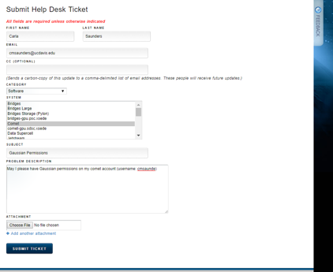

# TantilloLab
## Welcome
Hello there!😊

This repository is for Tantillo Lab general information on:

1. Comet account set up and common questions.

2. Gaussian job setup, submitting tricks, syntax... summarized by myself.  *Coming soon...*

3. Please let me know if you have any question or feedback! (yuezh@ucdavis.edu)

## 1. Comet New users guide

This section is meant to help you set up comet supercomputer account and help you learn how to submit gaussian jobs. 

### Table of content 
***
1. [Set up XSEDE account/Obtain Gaussian permission](#1)
2. [Login through terminal](#2)
3. [Set up Job Script](#3)
4. [Run Gaussian jobs](#4)
5. [Keep track of your usage](#5)
6. [Questions about Comet?](#6)

<a name="1"><a/>
#### 1. Set up XSEDE account / Obtain Gaussian permission
1.	Go to [XSEDE portal](portal.xsede.org/#/guest), then go to Create Account.
2.	Remember your username/password.
3.	Email Dean and ask to be added to XSEDE group account.

4.	Obtain Gaussian permission: Hover your mouse over “HELP” in the menu bar, and click on “Help Desk”. Submit a ticket asking for Gaussian permissions for your comet account.



#### 2. Login through terminal
<a name="2"><a/>

1. To log in to your account through the terminal: Use the command (they’re the same) in terminal (if you are not familiar with bash, see lab manual first chapter):
`ssh username@comet.sdsc.xsede.org` or `ssh username@comet.sdsc.edu`

2. Your password should be the same as on the XSEDE website. Sometimes it’ll take a while for your account to be ready. If you can’t access it, wait a day and try again. If you still can’t log in, you can try resetting your XSEDE password.

#### 3. Set up Job Script
<a name="3"><a/>
To run a Gaussian.com file, you need to set up .job file first. The job file tells the computer how many processors/how much memory you will use, and calls your gaussian input.

Here’s how to make a .job file:

1. Download “cometg09” in the github repository. Sync it to your Comet account home.
2. Make a folder called "bin" in your Comet account home (if it's not there already):  `mkdir ~/bin/` and place the script ("cometg09", see file ) in the bin folder `mv cometg09 ~/bin/`
3. Do `chmod 755 cometg09` to make it executable. 
4. In cometg09 file, replace the existing email address with your address.
5. MAKE SURE THAT **nodes=1** AND **ntasks-per-node=8**!


#### 4. Run Gaussian jobs
<a name="4"><a/>
1.	Set up your Gaussian input file as usual (Please note that the script we have is for job input with ".com" file type so don’t forget to make the respective changes, if you run other input types).
Here’s a sample .com file:

    %nprocshared=8

    %mem=16GB

    %chk=7_mEH.chk

    %nosave <br />
    \# opt freq b3lyp/6-31+g(d,p) 
    <br />
    Title Card Required
    <br />
    0 1

    C                  1.22871037    0.08515815    0.00000000

    C                  2.62387037    0.08515815    0.00000000

    ……

2.	Upload the .com from your computer to Comet, in specific project folders as how you prefer. 

3.	In the folder, type "cometg09 [molecule1].com". A job file should appear as [molecule1].job. Edit the run time of the .job file. For example, #SBATCH -t 1:00:00 means one hour long job.

    Importantly, we are for time based on the processors you indicate in your job file! MAKE SURE YOUR COM FILE HAS: 
    %nproc=8

    %mem=16GB

4.	Type "sbatch file.job" to submit your calculation. This job script then waits in a queue, and when it reaches the top will run your job.

    (Note, the queue is controlled by the "Partition" variable as described above. Other than that, you can't control which one run first or second. It all depend on their system calculation based on what processors are available and how much the job is asking for.)

5.	Job monitoring:

    The program used for this queue is called Slurm. Here are a few basic commands for slurm:

    `squeue -u username` shows what jobs you’ve submitted, you can create an alias in your ~/.bash_profile so you won't have to type this all the time.

    `squeue | wc -l` the total number of jobs submitted to the supercomputer.

    `sbatch file.job` runs your job file.

    `scancel #######` using the job number – you can get this from the queue.

    Note: Each job you run will produce a slurm#####.out file, where the number is the same as the job number. These are generally blank, and not important unless you need to troubleshoot a problem with the SLURM system.

6. Once the job finishes or terminates with error, the system should email you about the status. 


#### 5. Keep track of your usage
<a name="5"><a/>
Log into your XSEDE web account/user portal, and under “allocations/usage” it should have the recommended burn rate so you can keep a good pace. 

#### 6. Questions about Comet?
<a name="6"><a/>
1.	Email Tiffany (yuezh@ucdavis.edu)
2.	Go to XSEDE user portal and [submit a ticket](https://portal.xsede.org/group/xup/tickets), and submit a ticket.


##### Edited: 09-17-17


<!-->

Syntax for myself

1. hyperlink
[this is the description](https://support.squarespace.com/hc/en-us/articles/206543587-Markdown-cheat-sheet)

2. code
This paragraph has some `variable` inline code.
```html
<p>A paragraph example<p/>
```
```javascript
let num= Math.random();
```
3. picture


4. Some paragraph with text
> blockquote text below the paragraph

5. Tables

| heading | header | head |
| --- | --- | --- |  
| content | more content | text |
| more | more  | more |

6. Text

This is being *created* on a **Friday** ~~Satruday~~

7. List
- first
    - second
        - third
